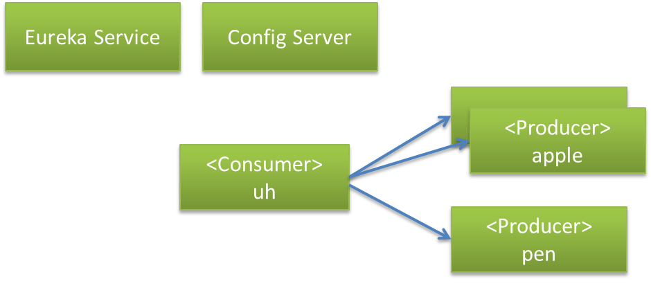

# Hello Spring Cloud !

## やってみること

以下のSpring Cloudのプロダクトを実際に試し、Spring Cloudの基礎を理解する。
- Eureka[Service Discovery]
- Ribbon[Client-side Load Balancing]
- Hystrix[障害検知、対応（Circuit Breaker）]
- Config Server[設定の集中管理]

## 基本構成



## Eureka、Ribbon、そしてHystrix

### Eureka Serverの作成

Spring InitializerでdependeciesにEureka Serverを指定

application.properties

```sh
# 一般的に8761が使われるらしい
server.port=8761
# Eurekaサーバーへ自身の登録をしない
eureka.client.register-with-eureka=false
eureka.client.fetch-registry=false
```

EureakaApplication.java
```java
@EnableEurekaServer
@SpringBootApplication
public class EurekaApplication {

	public static void main(String[] args) {/* ... */}
}
```

これだけでOK

---

### Producer 


pen,appleの各サービスを作成します。

dependenciesにEureka Discovery

PenApplication.java
```java
@EnableEurekaClient /* <- Service登録のために有効化 */
@SpringBootApplication
@RestController
public class PenApplication {

	@RequestMapping("/")
	String pen() {
		return "pen";
	}

	public static void main(String[] args) {/* ... */}
}
```

application.properties
```sh
server.port=8082
spring.application.name=pen
# 登録先のEurekaサービスを指定
eureka.client.serviceUrl.defaultZone=http://localhost:8761/eureka/

# 情報の更新間隔(デフォルト30秒)
eureka.instance.lease-renewal-interval-in-seconds=3
# インスタンスのID(ダッシュボードのリンク名などに使われる)
eureka.instance.metadata-map.instanceId=${spring.application.name}:${random.value}
# ホスト名の代わりにIPアドレスを使用(ホスト名を解決できないDockerを使う場合など)
eureka.instance.prefer-ip-address=true
```

同様に、penサービスも作成。


起動後、Eurekaにアクセスしてみよう。

http://localhost:8761/


---
### Consumer

ここはLoadBalancing, CircuitBreakerと一気にいきます。

dependenciesにEureka Discovery,Ribbon,Hystrixを追加

UhApplication.java
```java
@SpringBootApplication
@EnableCircuitBreaker // <- CircuitBreakerを有効化
@EnableEurekaClient // <- Service DiscoveryのためEurekaClientを有効化（@EnableDiscoveryClientでも可。）
@RestController
public class UhApplication {

	@Autowired
	UhService uhService;

	@RequestMapping("/")
	String uh() {
		return uhService.uh();
	}

	public static void main(String[] args) {/* ... */}

}
```

UhService.java

クライアントロードバランシングと、Hystrixによる障害時の既定の応答を実装。
@HystrixCommandアノテーションは@Service、@Componentアノテーションが設定されているクラスにしか使えないので注意が必要

```java
@Service
public class UhService {

	@Bean
	@LoadBalanced // <- これを指定すると、RibbonがインターセプトしてLoadBalancingが有効になる。
	RestTemplate restTemplate() {
		return new RestTemplate();
	}

	@Autowired
	RestTemplate restTemplate;

	@HystrixCommand(fallbackMethod = "uhhun") // <- Hystrixで障害検知され、サーキットがOPENになった時の代替メソッドを指定
	public String uh() {
            // http://サービス名による指定が可能に
            // @LoadBalancedとセットなので注意。Ribbon使わない場合のやり方は参考サイト参照
		return restTemplate.getForObject("http://apple", String.class) + " "
				+ restTemplate.getForObject("http://pen", String.class);

	}

	public String uhhun() {
		return "Sorry ,not available now.";
	}

}
```

application.properties

自分の登録を抑制してもよいが、必要最低限の設定

```sh
server.port=9001
spring.application.name=un
eureka.client.serviceUrl.defaultZone=http://localhost:8761/eureka/
```
---


## Configによる集中管理

あらかじめGitHub上に設定ファイルをUPしておく。

pen.properties
```sh
message=pen
```
通常は、pen-production.properties、などと環境によって切り替えられるように複数準備するっぽい

### Config Server

dependenciesにConfig Serverを設定

application.properties(bootstrapの方がいいのか？)

```sh
# 慣例的に8888が使われるっぽい
server.port=8888
# コンフィグファイルが格納してあるgitリポジトリのURI
spring.cloud.config.server.git.uri=https://github.com/fourpigs/config-files.git

```

ConfigApplication.java
```java
@EnableConfigServer // <- Config Serverにする
@SpringBootApplication
public class ConfigApplication {

	public static void main(String[] args) { /* ... */ }
}
```
これだけ。

### Config Clientからの利用

@ValueアノテーションでProducerのpenアプリケーションの出力する文言をconfigから取得する。

```java
	@Value("${message}")
	private String message;

	@RequestMapping("/")
	String pen() {
		return message;
	}
```

これでうまく表示された。

### Refresh on runtime

Gitリポジトリ上のファイルを更新しただけでは起動中のアプリケーションに設定は反映されない。
refreshエンドポイントにアクセスすると起動中に反映させるらしいが、うまく動かない。
（POSTしても404になる。actuator/refreshだとつながるが、別物？）

http://www.devglan.com/spring-cloud/refresh-property-config-runtime
-> 参考にしたガイドは古いバージョンのものっぽい。actuator/refreshで正しい。

＜追記＞
@refreshScopeを付けたControllerを突貫で作成してrefureshできました。

PenApplication.java
```java
public class PenApplication {

	@RefreshScope
	@RestController
	class MessageRestController {

		@Value("${message:Hello default}")
		private String message;

		@RequestMapping("/")
		String pen() {
			return this.message;
		}
	}

	public static void main(String[] args) { /* ... */ }

}
```
---
## DEMO

http://localhost:9001/


---
## 参考サイト

[ぱぱっと理解するSpring Cloudの基本  by KAZUKI KUMAGAIさん](https://www.slideshare.net/kazukikumagai1/spring-cloud)

[Spring Boot + Netflix Eureka by 谷本 心さん](https://www.slideshare.net/shintanimoto/spring-boot-netflix-eureka)

[Spring Cloud Netflixを使おう #jsug by Toshiaki Makiさん](https://www.slideshare.net/makingx/spring-cloud-netflix)

[Client Side Load Balancing with Ribbon and Spring Cloud](https://spring.io/guides/gs/client-side-load-balancing/)

[Spring Cloud Configのリファレンス読んだ by Kimullaさん](http://kimulla.hatenablog.com/entry/2016/03/04/Spring_Cloud_Config%E3%81%AE%E3%83%AA%E3%83%95%E3%82%A1%E3%83%AC%E3%83%B3%E3%82%B9%E8%AA%AD%E3%82%93%E3%81%A0)

みなさまに感謝。

---
## 今後の予定

- Spring Cloud基礎の続き
    - Config busによる一括リフレッシュ
    - Hystrixダッシュボードができてないのでそれを確認

- CQRSの実践
    - immurtable modeling
    - Spring Stream
	
---
## おしまい

うらがみさんより
今回はサンプルだからいいが、サービスの呼び出しはシリアルにすべきではない。
- non-blocking-io
- Spring reactor
- spring-web-flux
